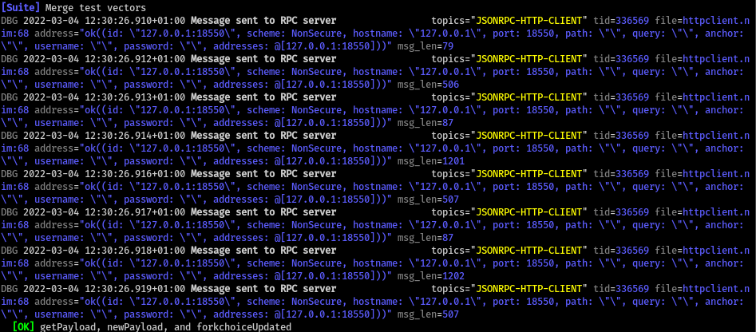
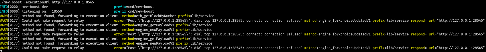
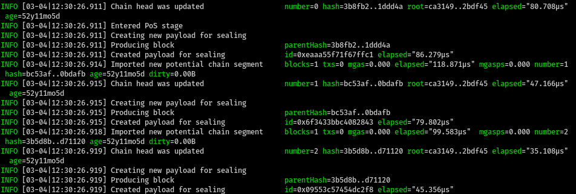
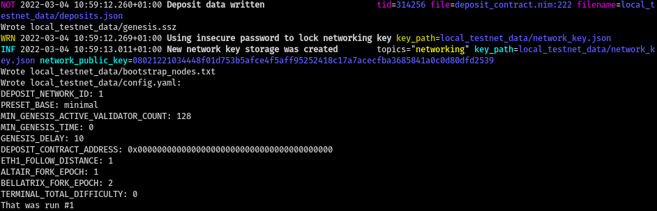
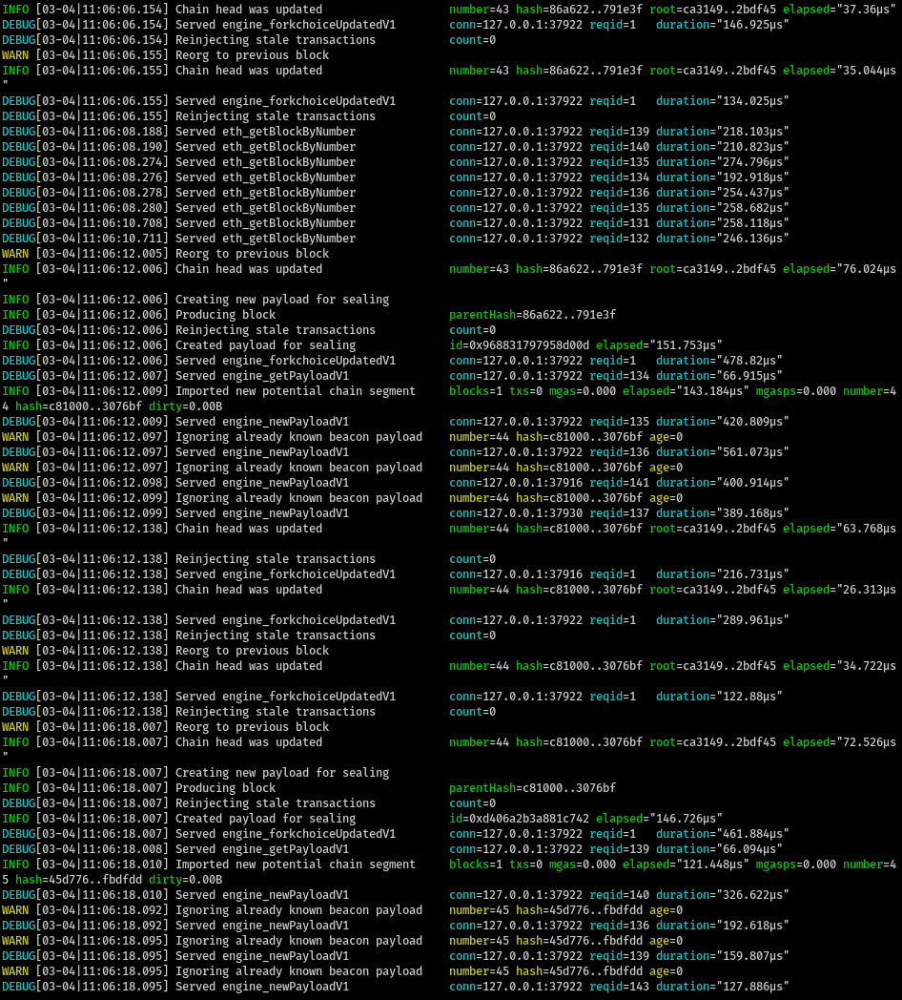
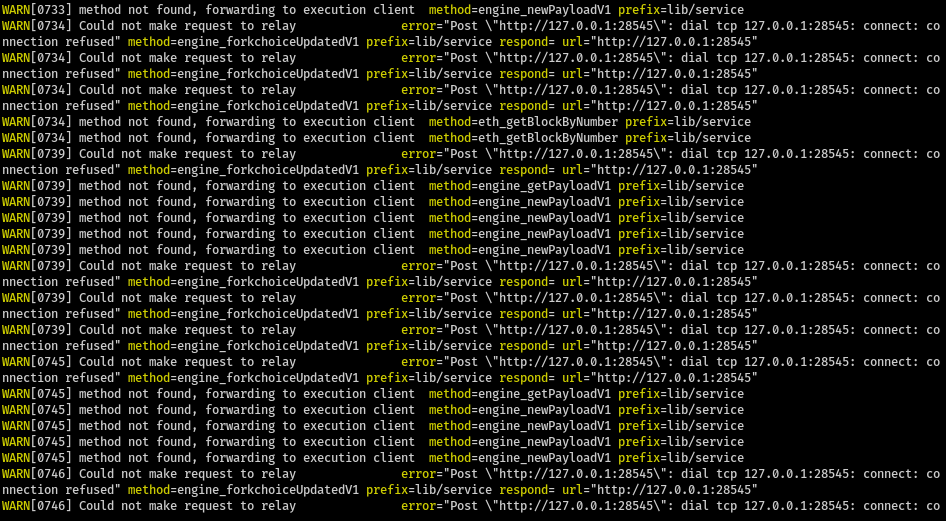

# How to run Geth

- Clone Geth: `git clone --branch merge-kiln-v2 https://github.com/MariusVanDerWijden/go-ethereum.git ~/execution_clients/go-ethereum`
- Build Geth with `make geth`
- Run `scripts/run-catalyst.sh` to run Geth.

# How to run mev-boost

- Clone mev-boost:
```
git clone https://github.com/flashbots/mev-boost
cd mev-boost
git checkout 090c4d95591584909891a80a38b705f04887e4f2 # in kiln branch
```
- Apply the following patch to keep consistent with port numbers:
```
diff --git a/Makefile b/Makefile
index 1ce023f..8c8df78 100644
--- a/Makefile
+++ b/Makefile
@@ -22,7 +22,7 @@ run:
 	./mev-boost
 
 run-boost-with-mergemock:
-	./mev-boost -executionUrl http://127.0.0.1:8550
+	./mev-boost -executionUrl http://127.0.0.1:8545
 
 run-boost-with-relay:
 	./mev-boost -relayUrl http://127.0.0.1:18545
@@ -34,7 +34,7 @@ run-mergemock-engine:
 	cd $(MERGEMOCK_DIR) && $(MERGEMOCK_BIN) engine
 
 run-mergemock-consensus:
-	cd $(MERGEMOCK_DIR) && $(MERGEMOCK_BIN) consensus --slot-time=4s --engine http://127.0.0.1:18550 --test-runs 10
+	cd $(MERGEMOCK_DIR) && $(MERGEMOCK_BIN) consensus --slot-time=4s --engine http://127.0.0.1:18550
 
 run-mergemock-integration: build
 	make -j3 run-boost-with-mergemock run-mergemock-engine run-mergemock-consensus
```
- Run `make run-boost-with-mergemock`

# Verify that Nimbus's RPC code can interact with Geth and mev-boost

- Check out branch `kiln-mev-boost-test` of `nimbus-eth2`.

- Run `./env.sh nim c -r scripts/test_merge_vectors.nim`. It should show output akin to:




# How to run Nimbus local testnet with Geth

- Check out branch `kiln-mev-boost-test` of `nimbus-eth2`.
- Run (and keep running) `./scripts/run-catalyst.sh`.
- Run `./scripts/launch_local_testnet.sh --preset minimal --nodes 4 --disable-htop --stop-at-epoch 7 -- --verify-finalization --discv5:no`

This creates a 4-node local testnet with 128 validators.

The Nimbus console output will be similar to


Meanwhile, Nimbus is interacting with Geth in preparing, getting, and executing payloads:


And mev-boost, in its non-relay mode, is effectively proxying messages back and forth:

